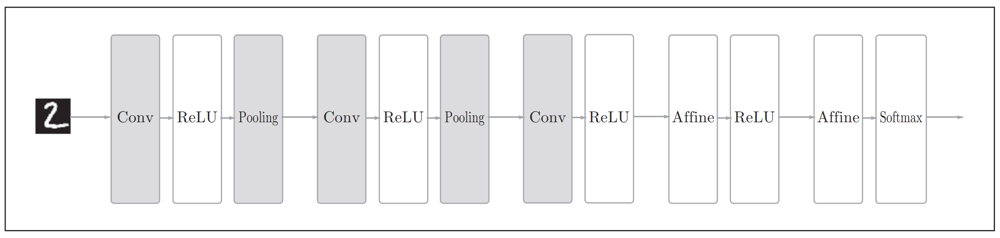
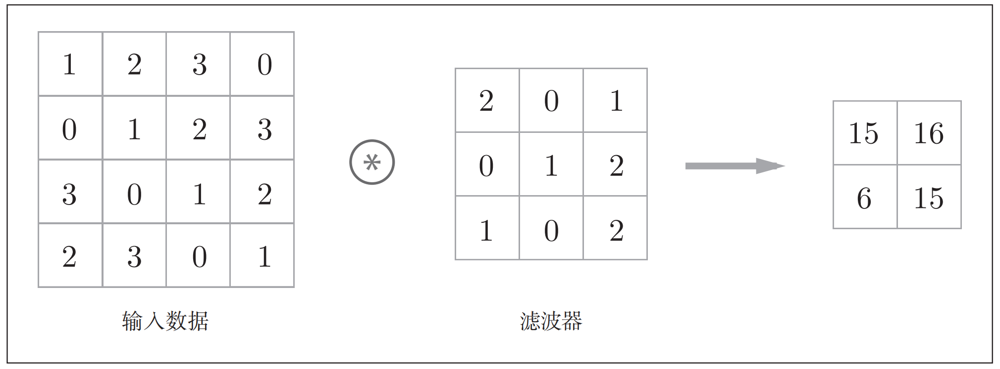
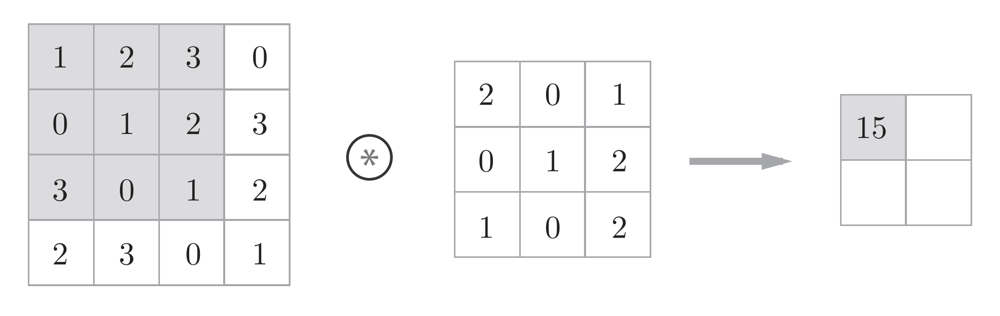
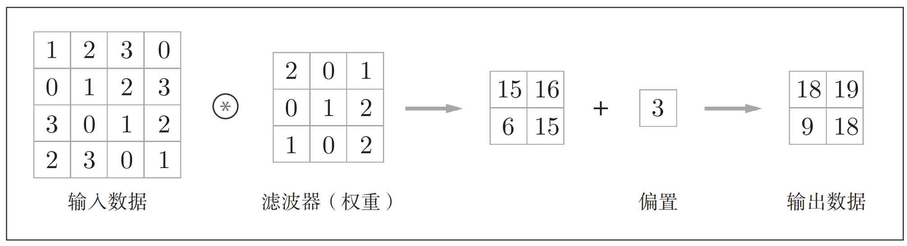
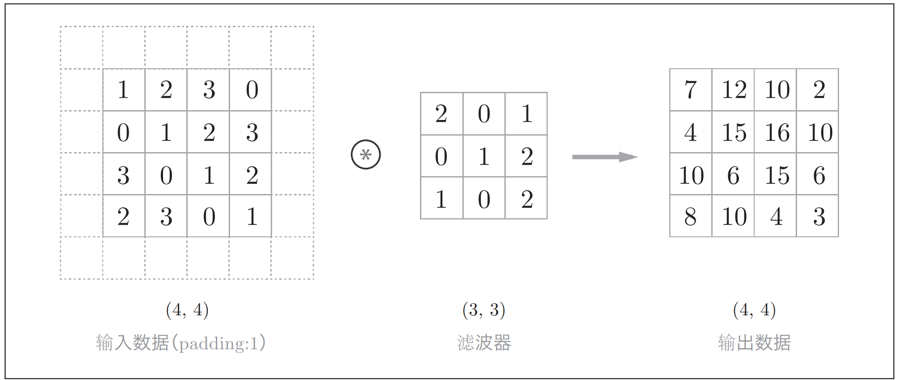
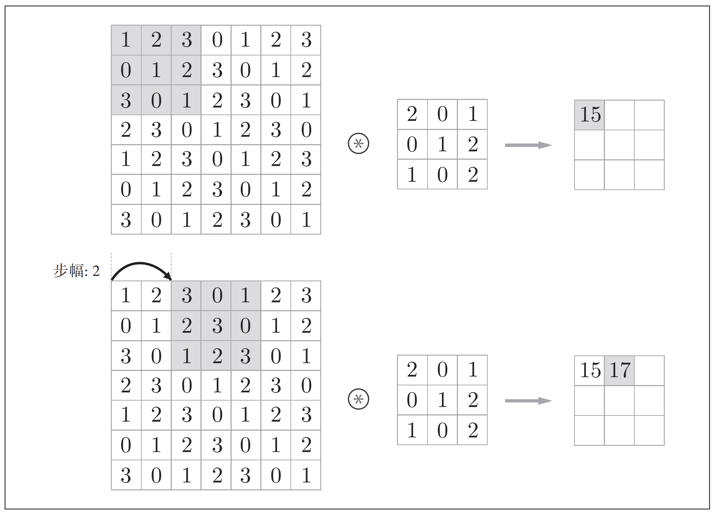
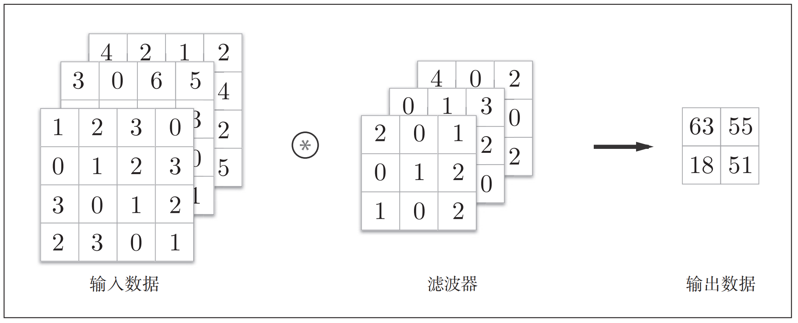
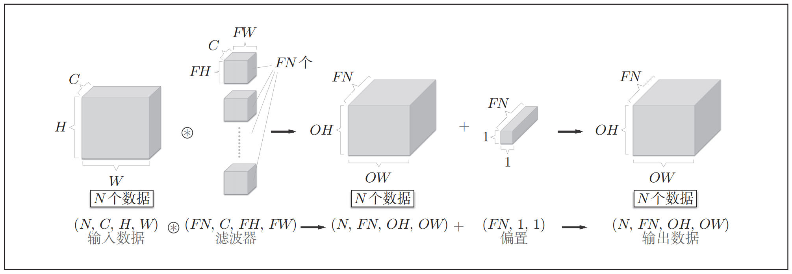
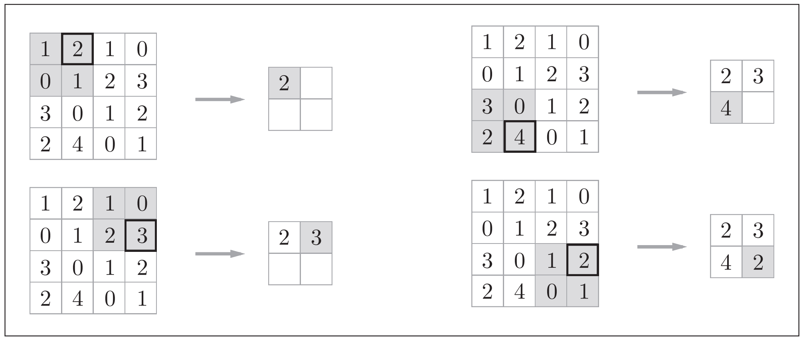

# 一、卷积神经网络概述

## 1、CNN简介

CNN和之前介绍的神经网络一样，可以像乐高积木一样通过组装层来构建。不过，
CNN中新出现了卷积层（Convolution层）和池化层（Pooling层）。 

## 2、多层神经网络的问题

- 参数较多，多层神经网络采用全连接的方式，稍微大点的图片计算复杂程度就会很大。
- 丢失空间信息，多层神经网络将图片像素矩阵展平为向量时丢失了图片中包含的二维信息。这种像素之间的位置信息可以帮助我们发现像素中规律。

CNN通过稀疏互联的层级来解决这个问题，这种局部连接层包含更少的权重并且在空间内共享。

## 3、CNN整体架构

CNN 的层的连接顺序是“Convolution - ReLU -（Pooling）”（Pooling层有时会被省略）。 然后跟着全连接神经网络"Affine-ReLU"组合 , 最后还是"Affine-Softmax"层输出最终结果（概率）。Affine为全连接层用来对卷积层提取的特征进行分类。

# 二、卷积层

## 1、输入输出

卷积层的输入输出数据称为特征图（feature map）。其中，卷积层的输入数据称为输入特征图（input feature map），输出数据称为输出特征图（output feature map）。 当输入数据是图像时，卷积层会以3维数据的形式接收输入数据，并同样以3维数据的形式输出至下一层。 

## 2、卷积运算

卷积层进行的处理就是卷积运算。卷积运算相当于图像处理中的“滤波器运算”。 卷积运算对输入数据应用滤波器（卷积核）。

​	对于输入数据，卷积运算以一定间隔滑动**滤波器**，将各个位置上滤波器的元素和输入的对应元素相乘，然后再求和（有时将这个计算称为乘积累加运算）。然后将这个结果保存到输出的对应位置。将这个过程在所有位置都进行一遍，就可以得到卷积运算的输出。

​	在全连接的神经网络中，除了权重参数，还存在偏置。 CNN中，滤波器的参数就对应之前的权重。包含偏置的卷积运算的处理流如上图。

## 3、填充

在进行卷积层的处理之前，有时要向输入数据的周围填入固定的数据（比如等），这称为填充（padding），是卷积运算中经常会用到的处理。比如，在图中，对大小为(4, 4)的输入数据应用了幅度为1的填充。“幅度为1的填充”是指用幅度为1像素的0填充周围。 

使用填充主要是为了调整输出的大小。比如，对大小为(4, 4)的输入数据应用(3, 3)的滤波器时，输出大小变为(2, 2)，相当于输出大小比输入大小缩小了2个元素。这在反复进行多次卷积运算的深度网络中会成为问题。为什么呢？因为如果每次进行卷积运算都会缩小空间，那么在某个时刻输出大小就有可能变为 1，导致无法再应用卷积运算。为了避免出现这样的情况，就要使用填充。在刚才的例子中，将填充的幅度设为1，那么相对于输入大小(4, 4)，输出大小也保持为原来的(4, 4)。因此，卷积运算就可以在保持空间大小不变的情况下将数据传给下一层。 

## 4、步幅

应用滤波器的位置间隔称为步幅（stride）。之前的例子中步幅都是1，如果将步幅设为2，则如下图所示，应用滤波器的窗口的间隔变为2个元素。 

在上图中，对输入大小为(7, 7)的数据，以步幅2应用了滤波器。通过将步幅设为2，输出大小变为(3, 3)。像这样，步幅可以指定应用滤波器的间隔 。

综上，增大步幅后，输出大小会变小。而增大填充后，输出大小会变大。假设输入大小为(H, W)，滤波器大小为(FH, FW)，输出大小为(OH, OW)，填充为P，步幅为S。此时，输出大小可通过公式进行计算： 

$$
OH = \frac{H + 2P - FH}{S} + 1
$$

$$
OW = \frac{W+ 2P - FW}{S} + 1
$$

当输出大小无法除尽时（结果是小数时），需要采取报错等对策。顺便说一下，根据深度学习的框架的不同，当值无法除尽时，有时会向最接近的整数四舍五入，不进行报错而继续运行。 

## 5、3维数据的卷积运算

通道方向上有多个特征图时，会按通道进行输入数据和滤波器的卷积运算，并将结果相加，从而得到输出。 

需要注意的是，在3维数据的卷积运算中，输入数据和滤波器的通道数要设为相同的值。 

## 6、批处理

我们希望卷积运算也同样对应批处理。为此，需要将在各层间传递的数据保存为4维数据。具体地讲，就是按(batch_num, channel, height, width)的顺序保存数据。 

这里需要注意的是，网络间传递的是4维数据，对这N个数据进行了卷积运算。也就是说，批处理将N次的处理汇总成了1次进行。 

# 三、池化层

池化层的主要作用是降低特征图的维度，避免过拟合。CNN中主要有两种池化层，最大池化层和全局平均池化层。

## 1、最大池化层

"Max池化”是获取最大值的运算，“2 × 2”表示目标区域的大小。如图所示，从2 × 2的区域中取出最大的元素。此外，这个例子中将步幅设为了2，所以2 × 2的窗口的移动间隔为2个元素。另外，一般来说，池化的窗口大小会和步幅设定成相同的值。比如， 3 × 3的窗口的步幅会设为3， 4 × 4的窗口的步幅会设为4等。

除了Max池化之外，还有Average池化等。相对于Max池化是从目标区域中取出最大值，Average池化则是计算目标区域的平均值。在图像识别领域，主要使用Max池化。 

## 2、池化层的特征

1. 没有要学习的参数

   池化层和卷积层不同，没有要学习的参数。池化只是从目标区域中取最大值（或者平均值），所以不存在要学习的参数。 

2. 通道数不发生变化

   经过池化运算，输入数据和输出数据的通道数不会发生变化。所示，计算是按通道独立进行的。 

3. 对微小的位置变化具有鲁棒性（健壮）

   输入数据发生微小偏差时，池化仍会返回相同的结果。因此，池化对输入数据的微小偏差具有鲁棒性。 