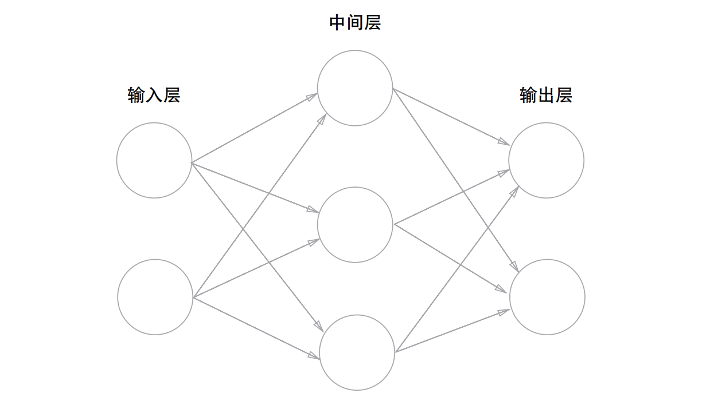
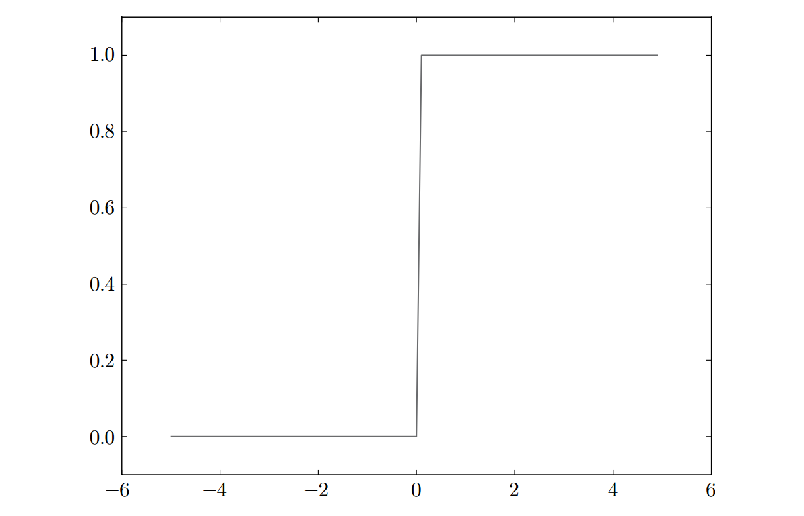
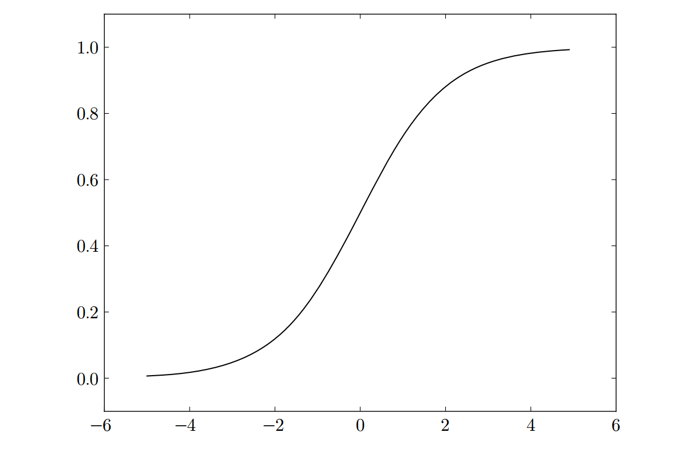
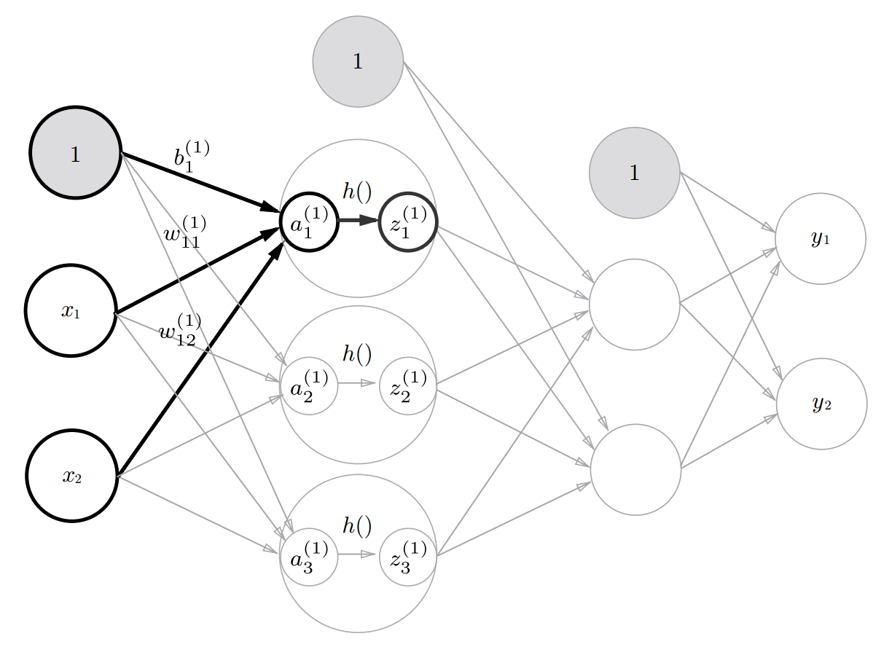
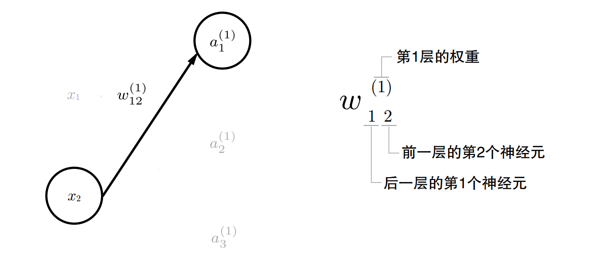

# 一、感知器

​	感知器(perceptron)是由美国学者FrankRoseblatt在1957年提出来的。为何我们现在还要学习这一很久以前就有的算法呢？因为感知机也是作为神经网络（深度学习）的起源的算法。因此，学习感知机的构造也就是学习通向神经网络和深度学习的一种重要思想。

## 1.什么是感知器

​	感知机接收多个输入，生成一个输出，输出只有两种1和0。

​	

​									**图1.1 有两个输入的感知机**

图1-1是一个接收两个输入的感知机. $x_1$、$x_2$是输入，$y$是输出，$w_1$、$w_2$是权重。图中的○称为神经元或者节点。输入被送往神经元时，会被分别乘以固定的权重$(w_1x_1,  w_2x_2)$。神经元会计算传送过来的输入的总和，只有当这个总和超过了某个界限值时，才会输出1。这也称为“神经元被激活” 。这里将这个界限值称为阈值，用符号θ表示。
$$
y =
\begin{cases}
1, & (w_1x_1 + w_2x_2) > \theta \\
0, & (w_1x_1 + w_2x_2) \leq \theta
\end{cases}
$$
权重越大，对应该权重的信号的重要性就越高。

## 2.逻辑运算

使用感知器可以解决简单的逻辑运算，与门(AND), 与非门(NOT AND), 或门(OR).

​	

​										**1-2 与门真值表**

满足图2-2的条件的参数的选择方法有无数多个。比如，当
$(w_1, w_2, θ) = (0.5, 0.5, 0.7) $时，可以满足图 2-1的条件。

我们看着真值表这种“训练数据”，人工考虑（想到）了参数的值。而机器学习的课题就是将这个决定参数值的工作交由计算机自动进行。 学习是确定合适的参数的过程，而人要做的是思考感知机的构造（模型），并把训练数据交给计算机。

## 3.偏置和权重

$$
y =\begin{cases}1, & (b + w_1x_1 + w_2x_2) > 0 \\0, & (b + w_1x_1 + w_2x_2) \leq 0\end{cases}
$$

令$b = -\theta$， $b$称为偏置，$w_1$和$w_2$称为权重, 但是请注意，偏置和权重$w_1$、$w_2$的作用是不一样的。具体地说， $w_1$和$w_2$是控制输入的重要性的参数，而偏置是调整神经元被激活的容易程度（输出为1的程度）的参数。有时也会将$b$、$w_1$、$w_2$这些参数统称为权重。

## 4.单层感知机的局限性

单层感知机的局限性就在于它只能表示由一条直线分割的空间,无法表示用曲线分割的空间。弯曲的曲线无法用感知机表示

​	

​		**图1-3　○和△表示异或门的输出。可否通过一条直线作出分割○和△的空间呢？**


​	

​					**图1-4　使用曲线可以分开○和△**

## 5.多层感知机

​	单层感知机虽然不能表示异或，但多层感知机的叠加却可以。

​	

​						**图1-5　通过组合与门、与非门、或门实现异或门**


​	

​					**图2-6　用感知机表示异或门**			

叠加了多层的感知机也称为多层感知机（multi-layered perceptron）。异或可以通过多层感知机实现。


图2-6中的感知机总共由3层构成，但是因为拥有权重的层实质上只有2层（第0层和第1层之间，第1层和第2层之间），所以称为“2层感知机”。不过，有的文献认为图2-6的感知机是由3层构成的，因而将其称为“3层感知机”。


## 6.感知机与计算机

​	多层感知机能够进行复杂的表示，甚至可以构建计算机。那么，什么构造的感知机才能表示计算机呢？层级多深才可以构建计算机呢？

​	**理论上**可以说2层感知机就能构建计算机。这是因为，已有研究证明，2层感知机（严格地说是激活函数使用了非线性的sigmoid函数的感知机）可以表示任意函数。但是，使用2层感知机的构造，通过设定合适的权重来构建计算机是一件非常累人的事情。

​	实际上，在用与非门等低层的元件构建计算机的情况下，分阶段地制作所需的零件（模块）会比较自然，即先实现与门和或门，然后实现半加器和全加器，接着实现算数逻辑单元(ALU), 然后实现CPU。因此，通过感知机表示计算机时，使用叠加了多层的构造来实现是比较自然的流程。

## 7.总结

​	感知机从算法的角度来说就是单位阶跃函数+线性回归算法。

# 二、神经网路

## 1.1 从感知器到神经网络

​	一般而言，“朴素感知机”是指单层网络，指的是激活函数使用了阶跃函数 的模型。“多层感知机”是指神经网络，即使用`sigmoid` 函数等平滑的激活函数的多层网络。

​	

​	如图所示。我们把最左边的一列称为输入层，最右边的一列称为输出层，中间的一列称为中间层。中间层有时也称为隐藏层.

​	图中的网络一共由 3 层神经元构成, 但实质上只有 2层神经元有权重，因此将其称为“2层网络”。


## 1.2 激活函数

​	神经网络与感知机的一个最大区别是它使用了“阶跃函数”之外的其他激活函数，比如sigmoid函数。sigmoid函数相比"阶跃函数"更佳平滑.

​	阶跃函数和sigmoid函数均为非线性函数, 线性函数是一条笔直的直线，而非线性函数，顾名思义，指的是不像线性函数那样呈现出一条直线的函数。

​	激活函数一定是非线性函数，它的主要作用就是增加神经网络的非线性，因为线性函数的线性组合还是线性函数，这样的话多层神经网络就没有意义。

​	输出层的激活函数，要根据求解问题的性质决定。一般地，回归问题可以使用恒等函数，二元问题可以使用sigmoid函数，多元分类问题可以使用softmax函数。所谓恒等函数，就是按输入原样输出，对于输入的信息，不加任何改动地直接输出。

​	常见的激活函数:

- 阶跃函数:  

$$
h(x) =\begin{cases}1, & x > 0 \\0, & x \leq 0\end{cases}
$$

​	


-  sigmoid函数(S函数)
  $$
  h(x) = \dfrac {1}{1+e^{-x}}
  $$
  

  

- Relu函数
  $$
  h(x) =\begin{cases}x, & x > 0 \\0, & x \leq 0\end{cases}
  $$
  

  

- softmax函数

$$
\sigma(x) =  \dfrac {e^{a_k}}{ \sum_{i=1}^n e^{a^i}   }
$$

**注意**: softmax函数有一个缺陷就是溢出问题，softmax函数的实现中要进行指数函数的运算，但是此时指数函数的值很容易变得非常大。如，$e^{1000}$的结果会返回一个表示无穷大的inf。

改进: 先进行归一化，在求值

```python
a = np.array([1010, 1000, 990])
np.exp(a) / np.sum(np.exp(a))
#  array([nan, nan, nan])  没有计算正确的值

mi = np.min(a)     # 990                                 
ma = np.max(a)                                 
nor = (a-mi)/(ma-mi)    # 归一化 array([1. , 0.5, 0. ])   
np.exp(nor)/np.sum(np.exp(nor))                 
# array([0.50648039, 0.30719589, 0.18632372])

```

​	一般而言，神经网络只把输出值最大的神经元所对应的类别作为识别结果。并且，即便使用softmax函数，输出值最大的神经元的位置也不会变。因此，神经网络在进行分类时，输出层的softmax函数可以省略。在实际的问题中，由于指数函数的运算需要一定的计算机运算量，因此**输出层的softmax函数一般会被省略**

​	求解机器学习问题的步骤可以分为“学习” A 和“推理”两个阶段。首先， 在学习阶段进行模型的学习 ，然后，在推理阶段，用学到的模型对未知的数据进行推理（分类）。如前所述，推理阶段一般会省略输出层的 softmax 函数。在输出层使用 softmax 函数是因为它和
神经网络的学习有关系


## 1.3 3层神经网络

​	

3层神经网络：输入层（第0层）有2个神经元，第1个隐藏层（第1层）有3个神经元，第2个隐藏层（第2层）有2个神经元，输出层（第3层）有2个神经元




​								图２－６权重的符号

请注意，偏置的右下角的索引号只有一个。这是因为前一层的偏置神经元（神经元“1”）只有一个，索引表示的是后一层神经元的索引。

数学公式表示$a_1^{(1)}$
$$
a_1^{(1)} = a_{11}^{(1)}x1 + w_{12}^{(1)}x2 + b_1^{(1)}
$$
矩阵$W^{(1)}$表示第１层的权重：
$$
W^{(1)} = \begin{pmatrix}w_{11}^{(1)} & w_{12}^{(1)} & w_{13}^{(1)}\\\\w_{12}^{(1)} &w_{22}^{(1)} &w_{32}^{(1)}\end{pmatrix}
$$
向量$B^{(1)}$表示第一层的偏置:
$$
\begin{pmatrix} b_1^{(1)} & b_2^{(1)} & b_3^{(1)}\\ \end{pmatrix} \quad
$$

$$
A^{(1)} = \begin{pmatrix} a_1^{(1)} & a_2^{(1)} & a_3^{(1)}\\ \end{pmatrix} \quad
$$

$$
X^{(1)} = \begin{pmatrix} x_1 & x_2\\ \end{pmatrix} \quad
$$

第１层的加权和表示:
$$
A^{(1)} = XW^{(1)} + B^{(1)}
$$


# 三、神经网络的学习

​	神经网络的学习就是从训练数据学习权重参数，然后使用刚才学习到的参数对输入数据进行预测。

​	神经网络学习的策略是首先对输入数据进行前向传播(forward propagation)过程得到输出，然后计算输出与真实值之间的差别，最后通过反向传播跟新权重参数，重复这一过程直到权重参数没有更新，此时损失函数达到最小。

​	计算输出与真实值之间的差别通过损失函数计算。反向传播需要用到梯度下降算法实现。


## 1.损失函数

​	损失函数是表示神经网络性能的指标。神经网络通过减小损失函数，寻找最优权重参数。常用的误差函数有均方误差和交叉熵误差等。

- 均方误差(mean squared error MSE)

$$
E = \frac {1}{2} \sum_{k}({y_k - t_k})^2
$$

​	$y_k$表示神经网络的输出，$t_k$表示目标数据，k表示输出数据的维度，比如　手写数字识别的输出数据的维度是10 (0-9)。

- 交叉熵误差(cross entropy error)
  $$
  E = - \sum_{k}t_k\log y_k
  $$
  上式是一条数据的误差，如果批量计算多条数据则函数为:
  $$
  E = - \frac{1}{N}\sum_{N}\sum_{k}t_{nk}\log y_{nk}
  $$
  假设数据有N个， $t_{nk}$表示第n个数据的第k个元素的值（$y_{nk}$是神
  经网络的输出， $t_{nk}$是目标数据）, 不过最后还要除以N, 通过这样的
  平均化，可以获得和训练数据的数量无关的统一指标。

## 2.梯度下降


## 3.误差反向传播

