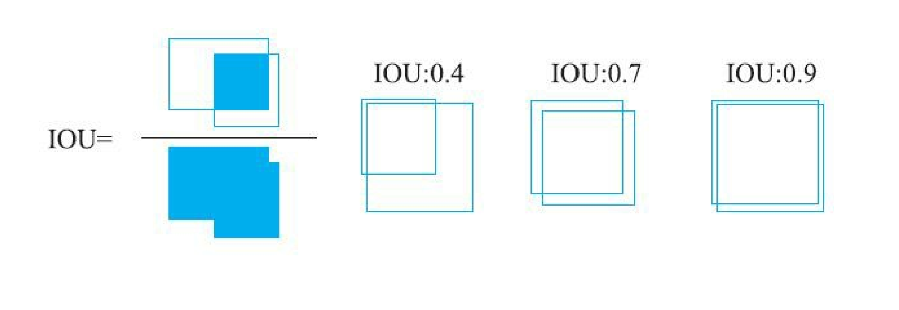
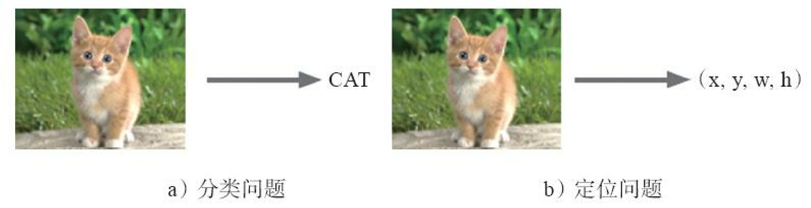
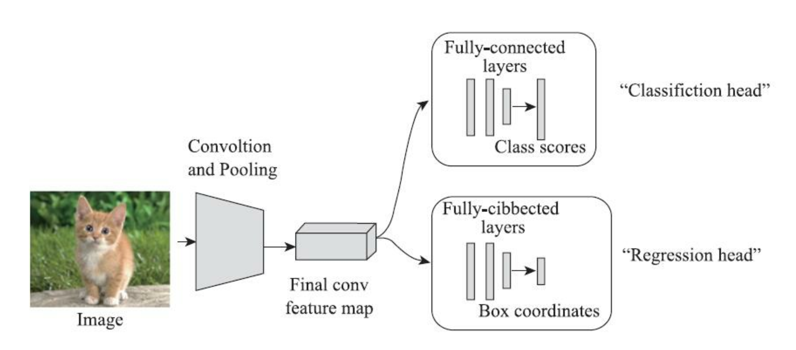
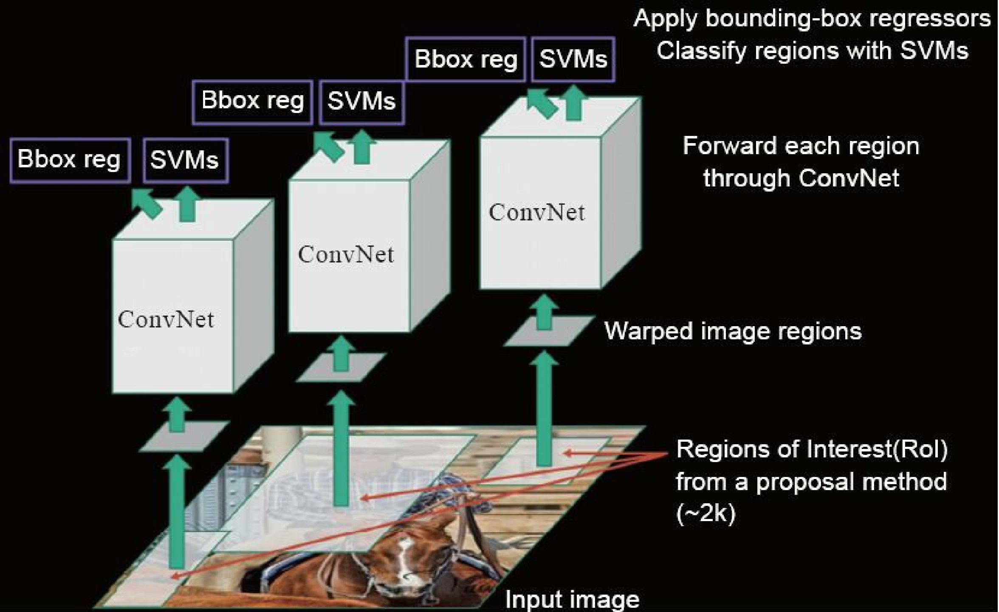
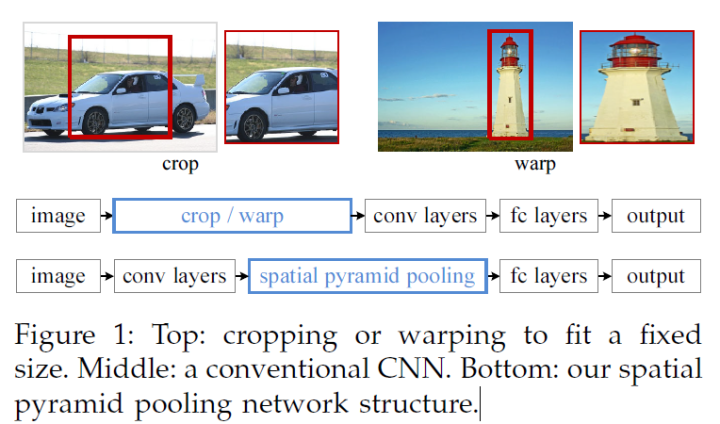
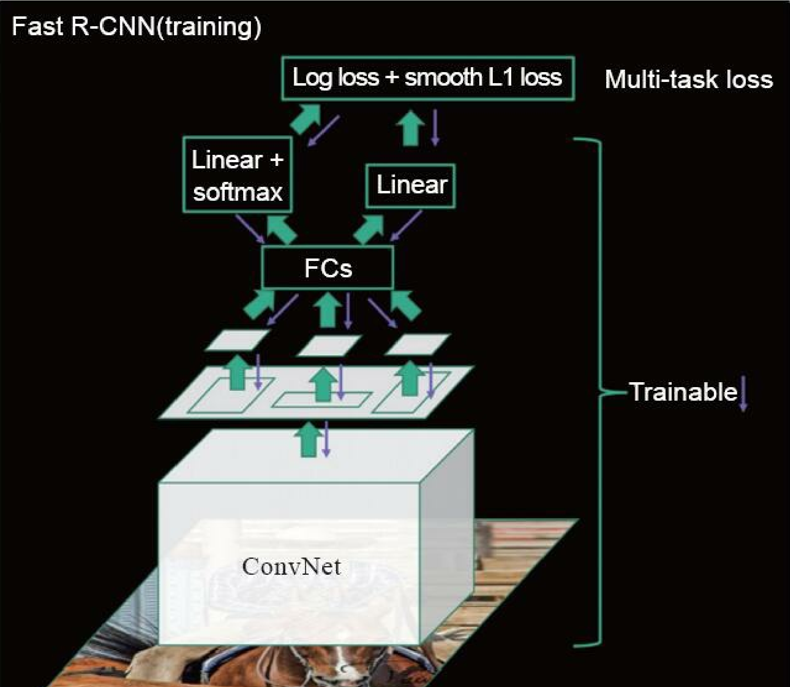
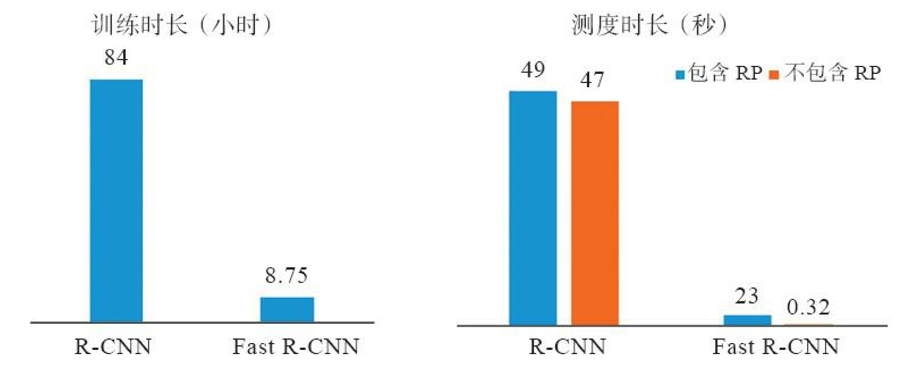
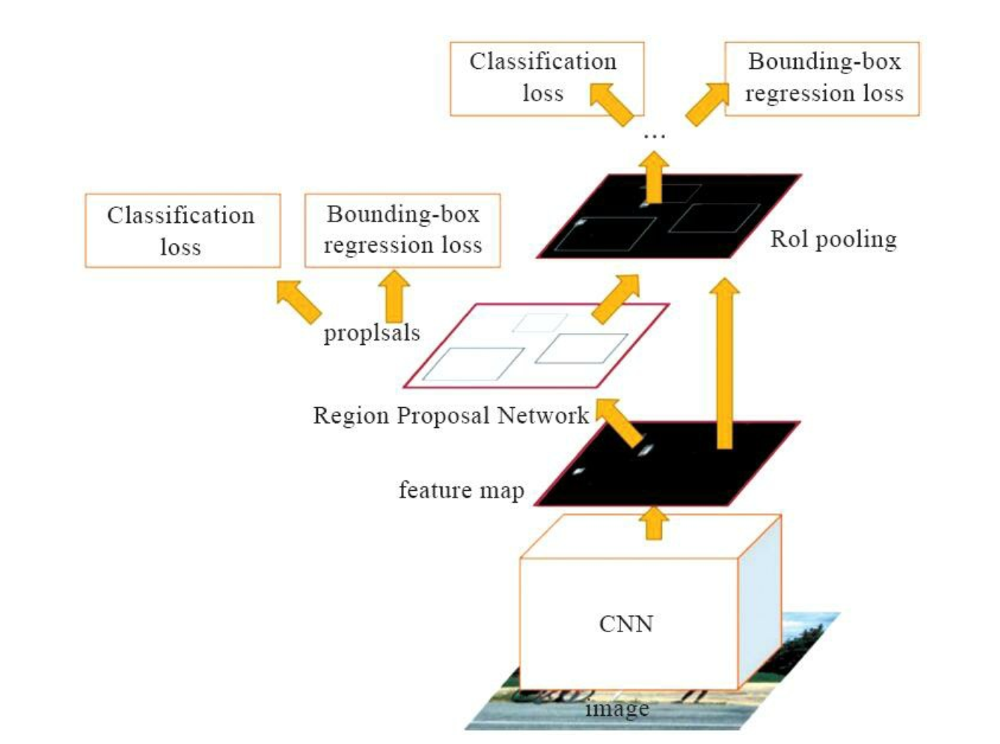
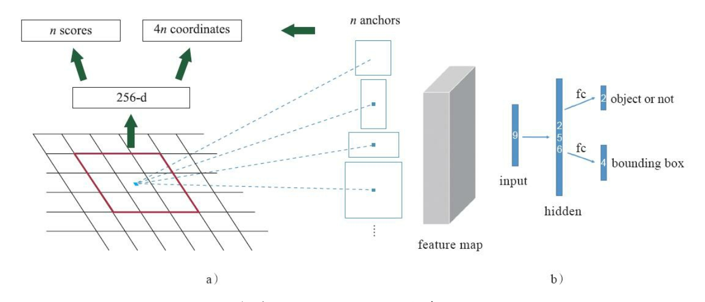
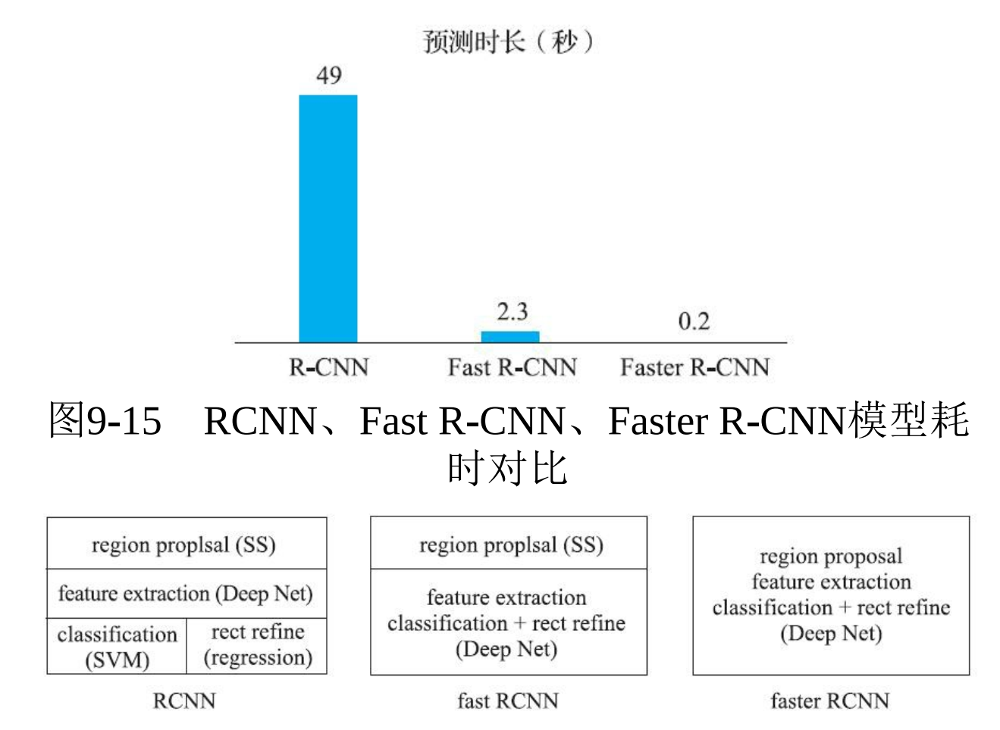

# 前言

目标检测在现实中的应用很广泛，我们需要检测图像中的物体位置以及类别。先明确如下2个定义:

1）定位+分类: 对于仅有一个目标的图片，检测出该目标所处的位置以及该目标的类别

2）目标检测: 对于有对个目标的图片，检测出所有目标所处的位置及其类别。


深度学习用于目标检测的算法从思路上来看，可以分为两大类，一类是**two stage**的方法，先由算法生成一系列候选框，在对候选框内的目标进行分类；另一类是**one stage**的方法，直接回归目标的类别概率和位置（矩形框左上角坐标与右下角坐标或左上角坐标与矩形长宽）。

One-Stage代表作：YOLO， SSD, Retina-Net

Two-Stage代表作:	R-CNN,  Fast R-CNN, Faster R-CNN


# 一、目标检测算法常用的概念

## 1、Bounding Box(BBox)

bbox是包含物体的最小矩形，该物体应在最小矩形内部。物体检测中关于物体位置的信息输出是一组(x,y,w,h)数据，其中x,y代表着bbox的左上角(或者其他固定点，可自定义)，对应的w,h表示bbox的宽和高.一组(x,y,w,h)可以唯一的确定一个定位框。

## 2、IOU(Intersection over Union)

IOU其实就是两个矩形面积的交集除以并集， 如图所示。 一般情况下， 当IOU>=0.5时， 可以认为两个矩形基本相交，所以在这个任务中， 假定在两个矩形框中， 1个矩形代表ROI， 另一个代表真实的矩形框， 那么当ROI和真实矩形框的IOU>=0.5时则认为是正样本， 其余为负样本。 




## 3、非极大抑制(Non-Maximum Suppression 又称NMS)

非极大值抑制(NMS)可以看做是局部最大值的搜索问题，把不是极大值的抑制掉，在物体检测上，就是对一个目标有多个标定框，使用极大值抑制算法滤掉多余的标定框。


# 二、分类+定位




分类问题返回目标是某一类别的概率，定位问题则需要模型返回目标所在的外界矩形框，即目标的（x, y, w, y）四元组。有一个比较容易实现的思路，将定位当作回归问题，具体的步骤如下：



​	1）训练一个分类模型，例如，AlexNet、VGGNet等。

​	2）在分类网络最后一个卷积层的特征图（feature map）上添加“regression head”

​	3）同时训练“classification head”和“regression head”， 为了同时训练分类和定位（ 定位是回归问题） 两个问题， 最终损失函数是分类和定位两个“head”产生的损失的加权和。 

​	4）在预测时同时使用分类和回归“head”得到分类+定位的结果。 这里需要强调一下的是， 分类预测出的结果就是C个类别， 回归预测的结果可能有两种： 一种是类别无关， 输出4个值； 一种是类别相关， 输出4*C个值， 这就要看读者想要哪种结果了。 


补充说明:

​	神经网络中不同的“head”通常用来训练不同的目标， 每个“head”的损失函数和优化方向均不相同。 如果你想让一个网络实现多个功能， 那么通常是在神经网络后面接多个不同功能的“head”。 


1. 


# 三、R-CNN

R-CNN: selective search + CNN + SVM + regression

由于目标检测和图像分类的不同，一张图可能存在多个目标，因此为了定位和识别出图片中的目标，一种暴力的目标检测方法就是使用滑动窗口,从左到右,从上到下扫描图片,然后用分类器识别窗口中的目标.为了检测出不同的目标,或者同一目标但大小不同,必须使用不同大小,不同宽高比的滑动窗口。把滑动窗口框出来的图片块resize(因为很多分类器只接受固定大小的图片输入)后,送给CNN分类器,CNN提取出4096个特征.然后使用SVM做分类,用线性回归做bounding box预测。但是这种方法有一个缺点就是： 它会产生很多无用的子区域。而 Selective Search 是另一种基于区域的方法，该方法能大大减少子区域的数量。并且在 R-CNN 和 Fast R-CNN 中均利用该算法来生成 Region Proposals。

## 1、selective search

[selective search][http://www.huppelen.nl/publications/selectiveSearchDraft.pdf]使用的是按层次合并算法（Hierarchical Grouping），基本思路如下：首先使用论文[“Efficient Graph-Based Image Segmentation”][http://cs.brown.edu/people/pfelzens/segment/]中的方法生成一些起始的小区域，之后使用贪心算法将区域归并到一起：先计算所有临近区域间的相似度（通过颜色，纹理，吻合度，大小等相似度），将最相似的两个区域归并，然后重新计算临近区域间的相似度，归并相似区域直至整幅图像成为一个区域。

该算法有三个优势：

1. 捕捉不同尺度(Capture All Scales):穷举搜索（Exhaustive Selective）通过改变窗口大小来适应物体的不同尺度，选择搜索（Selective Search）同样无法避免这个问题。算法采用了图像分割（Image Segmentation）以及使用一种层次算法（Hierarchical Algorithm）有效地解决了这个问题。
2. 多样化(Diversification):单一的策略无法应对多种类别的图像。使用颜色（color）、纹理（texture）、大小（size）等多种策略对分割好的区域（region）进行合并。
3. 计算速度快(Fast to Compute)

该方法主要包括两个内容：

1. Hierarchical Grouping Algorithm
2. Diversification Strategies


**1.1 Efficient Graph-Based Image Segmentation**

这篇论文的思想是把图像看作为一个图(graph)，图中的节点就是图像中的像素，而权重就是相邻像素之间的差异性。然后通过贪心算法不断融合差异性小的像素或者区域为一个区域，将图最后划分为数个区域(regions或者是components)，从而完成对图像的分割。

我们可以思考一件很直观的事情，两个区域之所以成为两个区域，而没有融合成为一个区域，是不是就是意味着这个区域内部元素的差异性要小于两个区域之间的差异性呢？换言之，如果区域之间的差异性比区域内部的差异性还要小的话，那实际上这两个区域就应该融合成为一个区域，因为比它们差异性大的都成为了一个区域了，那这两个区域也应该成为一个区域才对。这便是作者提出的判断两个区域是否应该融合为一个区域的标准，也是这篇文章的一个重要的思想。


算法步骤步骤：

0. 对于图G的所有边，按照权值进行排序（升序）
1. $S^0$是一个原始分割，相当于每个顶点当做是一个分割区域
2. q = 1,2,…,m 重复Step 3的操作（m为边的条数，也就是每次处理一条边）
3. 根据上次$S^{q-1}$的构建。选择一条边$o_q = (v_i, v_j)$，如果$v_i$和$v_j$在分割的互不相交的区域中，比较这条边的权值与这两个分割区域之间的最小分割内部差MInt，如果$w(o_q(v_i, v_j))$ <= MInt，那么合并这两个区域，其他区域不变；如果否，什么都不做。
4. 最后得到的就是所求的分割$S=S^m$


**1.2 Hierarchical Grouping Algorithm（层次合并算法）**

```shell
输入: 一张图片
输出：候选的目标位置集合L

算法：
1: 利用切分方法得到候选的区域集合R = {r1,r2,…,rn}
2: 初始化相似集合S = ϕ
3: foreach 遍历邻居区域对(ri,rj) do
4:     计算相似度s(ri,rj)
5:     S = S∪s(ri,rj)
6: while S not=ϕ do
7:     从S中得到最大的相似度s(ri,rj)=max(S)
8:     合并对应的区域rt = ri ∪ rj
9:     移除ri对应的所有相似度：S = S\s(ri,r*)
10:    移除rj对应的所有相似度：S = S\s(r*,rj)
11:    计算rt对应的相似度集合St
12:    S = S ∪ St
13:    R = R ∪ rt
14: L = R中所有区域对应的bounding box（即包围该区域的最小矩形框）
```


**1.3 Diversification Strategies（多样性策略）**

​	作者在这里主要考虑了三种不同的多样性策略：

- 颜色空间多样性，考虑RGB、灰度、HSV及其变种等
- 相似度多样性，既考虑颜色相似度，又考虑纹理、大小、重叠情况等。
- 初始化区域多样性，通过改变阈值初始化原始区域，阈值越大，分割的区域越少。


## 2、R-CNN训练过程




（1）选出潜在的目标候选区域（ROI）

​	R-CNN使用selective search 的方法选出了2000个潜在物体候选框

（2）训练一个好的特征提取器

​	R-CNN的提出者使用卷积神经网络AlexNet提取4096维的特征向量， 实际上使用VGGNet、GoogLeNet或ResNet等也可以。  AlexNet等网络要求输入的图片尺寸是固定的， 而ROI尺寸大小不定， 这就需要将每个ROI调整到指定尺寸，调整的方法有很多种，尺寸缩放、包含上下文、不包含上下文等。

​	为了获得一个好的特征提取器，一般会在ImageNet预训练好的模型基础上做调整，唯一的改动就是将ImageNet中的1000个类别的输出改为（C+1）个输出，其中，C是真实需要预测的类别个数，1是背景类。

​	提到训练， 就一定要有正样本和负样本 , 通过IOU获取正负样本。

​	至此， R-CNN的第二步特征提取器就可以开始训练了， 不过在训练过程中应注意， 需要对负样本进行采样， 因为训练数据中正样本太少会导致正负样本极度不平衡。 最终在该步得到的是一个卷积神经网络的特征提取器， 其特征是一个4096维特征向量。 

（3）训练最终的分类器

​	下面为每个类别单独训练一个SVM分类器。 这里介绍一个小技巧， SVM的训练也需要选择正负样本， R-CNN的提出者做了一个实验来选择最优IOU阈值， 最终仅仅选择真实值的矩形框作为正样本。 	

（4）训练回归模型

​	为每个类训练一个回归模型， 用来微调ROI与真实矩形框位置和大小的偏差 

## 3、预测阶段的步骤

​	1） 使用selective search方法先选出2000个ROI。

​	2） 所有ROI调整为特征提取网络所需的输入大小并进行特征提取， 得到与2000个ROI对应的2000个4096维的特征向量。

​	3） 将2000个特征向量分别输入到SVM中， 得到每个ROI预测的类别。

​	4） 通过回归网络微调ROI的位置。

​	5） 最终使用非极大值抑制（Non-Maximum Suppression， NMS） 方法对同一个类别的ROI进行合并得到最终检测结果。 NMS的原理是得到每个矩形框的分数（置信度）， 如果两个矩形框的IOU超过指定阈值， 则仅仅保留分数大的那个矩形框。 


## 4、R-CNN的问题

- 不论是训练还是预测， 都需要对selective search出来的2000个ROI全部通过CNN的Forward过程来获取特征， 这个过程花费的时间会非常长。 
- 卷积神经网络的特征提取器和用来预测分类的SVM是分开的， 也就是特征提取的过程不会因SVM和回归的调整而更新。 
- R-CNN具有非常复杂的操作流程， 而且每一步都是分裂的， 如特征提取器通过Softmax分类获得，最终的分类结果由SVM获得， 矩形框的位置则是通过回归方式获得 

## 5、一些容易困惑的问题

1. 关于正负样本的问题

   一张照片我们得到了2000个候选框。然而人工标注的数据一张图片中就只标注了正确的bounding box，我们搜索出来的2000个矩形框也不可能会出现一个与人工标注完全匹配的候选框。因此在CNN阶段我们需要用IOU为2000个bounding box打标签。如果用selective search挑选出来的候选框与物体的人工标注矩形框（PASCAL VOC的图片都有人工标注）的重叠区域IoU大于0.5，那么我们就把这个候选框标注成物体类别（正样本），否则我们就把它当做背景类别（负样本）。

2. CNN训练的时候，本来就是对bounding box的物体进行识别分类训练，在训练的时候最后一层softmax就是分类层。那么为什么作者闲着没事干要先用CNN做特征提取（提取fc7层数据），然后再把提取的特征用于训练svm分类器？

   这个是因为svm训练和cnn训练过程的正负样本定义方式各有不同，导致最后采用CNN softmax输出比采用svm精度还低。事情是这样的，cnn在训练的时候，对训练数据做了比较宽松的标注，比如一个bounding box可能只包含物体的一部分，那么我也把它标注为正样本，用于训练cnn；采用这个方法的主要原因在于因为CNN容易过拟合，所以需要大量的训练数据，所以在CNN训练阶段我们是对Bounding box的位置限制条件限制的比较松(IOU只要大于0.5都被标注为正样本了)；然而svm训练的时候，因为svm适用于少样本训练，所以对于训练样本数据的IOU要求比较严格，我们只有当bounding box把整个物体都包含进去了，我们才把它标注为物体类别，然后训练svm.

3. SVM训练阶段

   这是一个二分类问题，我么假设我们要检测车辆。我们知道只有当bounding box把整量车都包含在内，那才叫正样本；如果bounding box 没有包含到车辆，那么我们就可以把它当做负样本。但问题是当我们的检测窗口只有部分包含物体，那该怎么定义正负样本呢？作者测试了IOU阈值各种方案数值0,0.1,0.2,0.3,0.4,0.5。最后通过训练发现，如果选择IOU阈值为0.3效果最好（选择为0精度下降了4个百分点，选择0.5精度下降了5个百分点）,即当重叠度小于0.3的时候，我们就把它标注为负样本。一旦CNN f7层特征被提取出来，那么我们将为每个物体类训练一个svm分类器。当我们用CNN提取2000个候选框，可以得到2000*4096这样的特征向量矩阵，然后我们只需要把这样的一个矩阵与svm权值矩阵4096*N点乘(N为分类类别数目，因为我们训练的N个svm，每个svm包含了4096个权值w)，就可以得到结果了。

4. 位置精修

   目标检测问题的衡量标准是重叠面积：许多看似准确的检测结果，往往因为候选框不够准确，重叠面积很小。故需要一个位置精修步骤。 回归器：对每一类目标，使用一个线性脊回归器进行精修。正则项λ=10000。 输入为深度网络pool5层的4096维特征，输出为xy方向的缩放和平移。 训练样本：判定为本类的候选框中和真值重叠面积大于0.6的候选框。

5. 测试阶段

   使用selective search的方法在测试图片上提取2000个region propasals ，将每个region proposals归一化到227x227，然后再CNN中正向传播，将最后一层得到的特征提取出来。然后对于每一个类别，使用为这一类训练的SVM分类器对提取的特征向量进行打分，得到测试图片中对于所有region proposals的对于这一类的分数，再使用贪心的非极大值抑制（NMS）去除相交的多余的框。再对这些框进行canny边缘检测，就可以得到bounding-box(then B-BoxRegression)。

   （非极大值抑制（NMS）先计算出每一个bounding box的面积，然后根据score进行排序，把score最大的bounding box作为选定的框，计算其余bounding box与当前最大score与box的IoU，去除IoU大于设定的阈值的bounding box。然后重复上面的过程，直至候选bounding box为空，然后再将score小于一定阈值的选定框删除得到这一类的结果（然后继续进行下一个分类）。作者提到花费在region propasals和提取特征的时间是13s/张-GPU和53s/张-CPU，可以看出时间还是很长的，不能够达到及时性。

# 四、SPPNet


容易看出这里面存在的一些性能瓶颈：

- 速度瓶颈：重复为每个region proposal提取特征是极其费时的，Selective Search对于每幅图片产生2K左右个region proposal，也就是意味着一幅图片需要经过2K次的完整的CNN计算得到最终的结果。
- 性能瓶颈：对于所有的region proposal防缩到固定的尺寸会导致我们不期望看到的几何形变，而且由于速度瓶颈的存在，不可能采用多尺度或者是大量的数据增强去训练模型。

但是为什么CNN需要固定的输入呢？CNN网络可以分解为卷积网络部分以及全连接网络部分。我们知道卷积网络的参数主要是卷积核，完全能够适用任意大小的输入，并且能够产生任意大小的输出。但是全连接层部分不同，全连接层部分的参数是神经元对于所有输入的连接权重，也就是说输入尺寸不固定的话，全连接层参数的个数都不能固定。

何凯明团队的SPPNet给出的解决方案是，既然只有全连接层需要固定的输入，那么我们在全连接层前加入一个网络层，让他对任意的输入产生固定的输出不就好了吗？一种常见的想法是对于最后一层卷积层的输出pooling一下，但是这个pooling窗口的尺寸及步伐设置为相对值，也就是输出尺寸的一个比例值，这样对于任意输入经过这层后都能得到一个固定的输出。SPPNet在这个想法上继续加入SPM的思路，SPM其实在传统的机器学习特征提取中很常用，主要思路就是对于一副图像分成若干尺度的一些块，比如一幅图像分成1份，4份，8份等。然后对于每一块提取特征然后融合在一起，这样就可以兼容多个尺度的特征啦。SPPNet首次将这种思想应用在CNN中，对于卷积层特征我们也先给他分成不同的尺寸，然后每个尺寸提取一个固定维度的特征，最后拼接这些特征不就是一个固定维度的输入了吗？




上面这个图可以看出SPPnet和RCNN的区别，首先是输入不需要放缩到指定大小。其次是增加了一个空间金字塔池化层。通过上述方法虽然解决了CNN输入任意大小图片的问题，但是还是需要重复为每个region proposal提取特征啊。


# 五、Fast R-CNN

类似于RCNN，Fast RCNN首先通过Selective Search产生一系列的区域候选，然后通过通过CNN提取每个区域候选的特征，之后训练分类网络以及区域回归网络。对比SPPNet，我们可以看出Fast RCNN的区别所在，首先是将SPP换成了ROI Poling。ROI Poling可以看作是空间金字塔池化的简化版本，它通过将区域候选对应的卷积层特征图进行最大池化就好了。




**具体训练步骤**

​	1）将整张图片和ROI直接输入到全卷积的CNN中， 得到特征层和对应在特征层上的ROI（特征层的ROI信息可用其几何位置加卷积坐标公式推导得出）。

​	2）与R-CNN类似， 为了使不同尺寸的ROI可以统一进行训练， Fast R-CNN将每块候选区域通过池化的方法调整到指定的M\*N， 此时特征层上将调整后的ROI作为分类器的训练数据。 与R-CNN不同的是， 这里将分类和回归任务合并到一起进行训练，这样就将整个流程串联起来。  即先将整张图通过卷积神经网络进行处理， 然后在特征层上找到ROI对应的位置并取出， 对取出的ROI进行池化（此处的池化方法有很多） 。池化后， 全部2000个M*N个训练数据通过全连接层并分别经过2个head： softmax分类以及L2回归， 最终的损失函数是分类和回归的损失函数的加权和。 利用这种方式即可实现端到端的训练。 


Fast R-CNN极大地提升了目标检测训练和预测的速度， 如图所示。 从图中我们可以看出，Fast R-CNN将训练时长从R-CNN的84小时下降到了8.75小时， 每张图片平均总预测时长从49秒降低到2.3秒。 从图中我们还可以看出， 在Fast R-CNN预测的这2.3秒中， 真正的预测过程仅占0.32秒， 而Region proposal占用了绝大多数的时间。 




# 六、Faster R-CNN



Faster R-CNN作为目标检测的经典方法在现今很多实战项目和比赛中频频出现。 其实， Faster RCNN就是在Fast R-CNN的基础上构建一个小的网络， 直接产生Region Proposal来代替其他方法（如selective search） 得到ROI。 这个小型的网络被称为
区域建议网络（Region Proposal Network， RPN） 。Faster R-CNN的训练流程如图所示， 其中的RPN是关键， 其余流程与Fast R-CNN基本一致。 

**RPN原理**



RPN的核心思想是构建一个小的全卷积网络， 对于任意大小的图片， 输出ROI的具体位置以及该ROI是否为物体。 RPN网络在卷积神经网的最后一个特征层上滑动。 

上图a中最下面灰色的网格表示卷积神经网络的特征层， 红框表示RPN的输入， 其大小为3\*3， 而后连接到256维的一个低维向量上。 这个3\*3的窗口滑动经过整个特征层， 并且每次计算都将经过这256维的向量并最终输出2个结果： 该3\*3滑动窗口位置中是否有物体， 以及该滑动窗口对应物体的矩形框位置。如果还是不好理解， 那么我们将图a中的RPN顺时针旋转90度， 如图b所示， 现在我们可以很清晰地看出神经网络的结构了， 这里input维度是9， 即图a中的3*3大小 。

​	为了适应多种形状的物体， RPN定义了k种不同尺度的滑窗（因为有的目标是长的， 有的是扁的，有的是大的， 有的是小的， 统一用一个3\*3的滑窗难以很好地拟合多种情况） ， 它有一个专业的名词——anchor， 每个anchor都是以特征层（feature
map） 上的像素点为中心并且根据其尺度大小进行后续计算的。 在Faster-RCNN论文中， 滑窗在特征层的每个位置上使用3种大小和3种比例， 共3\*3=9种anchor， 在图a中， n=9。 

​	根据上面的介绍， 我们知道RPN包含2类输出：二分类网络输出是否为物体， 回归网络返回矩形框位置对应的4个值。

​	接下来， 我们看一下训练过程中的一些细节问题。 首先， 针对分类任务， 对于滑窗产生的每一个anchor都计算该anchor与真实标记矩形框的IOU。 当IOU大于0.7时， 便认为该anchor中含有物体； 当IOU小于0.3时， 便认为该anchor中不包含物体； 当IOU介于0.3～0.7时， 则不参与网络训练的迭代过程。

​	对于回归任务， 这里定义为anchor中心点的横、纵坐标以及anchor的宽、 高， 学习目标为anchor与真实bbox在这四个值上的偏移。 RPN为一个全卷积网络， 可以用随机梯度下降的方式端到端地进行训练。  

​	这里需要注意的是， 训练过程中能与真实物体矩形框相交的IOU大于0.7的anchor并不多， 它们绝大多数都是负样本， 因此会导致正负样本比例严重失衡， 从而影响识别效果。 因此， 在RPN训练的过程， 对每个batch进行随机采样（每个batch中有256个
样本） 并保证正负样本的比例为1： 1， 而当正样本数量小于128时， 取全部的正样本， 其余的则随机使用负样本进行补全。

​	使用RPN产生ROI的好处是可以与检测网络共享卷积层， 使用随机梯度下降的方式端到端地进行训练。 接下来我们看下Faster R-CNN的训练过程， 具体
步骤如下 :

​	1） 使用ImageNet模型初始化, 独立训练一个RPN网络。
​	2） 仍然用ImageNet模型初始化， 以及第1步里产生的建议区域训练Fast R-CNN， 得到物体的实际类别以及微调的矩形框位置。
​	3） 使用第2步中的网络初始化RPN， 固定前面的卷积层， 只调整RPN层的参数。
​	4） 固定前面的卷积层， 只训练并调整Fast RCNN的FC层。 




# 参考

图像分割：https://blog.csdn.net/xbcReal/article/details/75897836

selective search: https://www.cnblogs.com/zyly/p/9259392.html

​							 https://ranmaosong.github.io/2019/08/10/cv-selective-search/

​							https://www.jianshu.com/p/dbf58d84a2aa


R-CNN: https://zhuanlan.zhihu.com/p/23006190

SPPNet: https://zhuanlan.zhihu.com/p/27485018

Faster R-CNN（详细）: https://zhuanlan.zhihu.com/p/31426458 